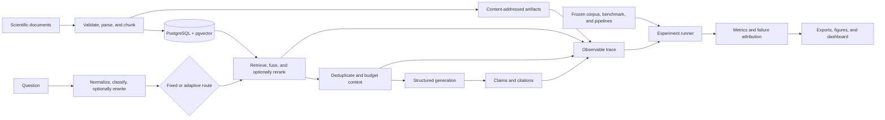

<div align="center">

# RAGScope

**An observable and adaptive retrieval-augmented generation evaluation platform for scientific dataset discovery.**


[Overview](#overview) · [Research](#research-design) · [Architecture](#architecture) · [Usage](#usage) · [Results](#current-results-status) · [Documentation](#documentation)

</div>

## Overview

RAGScope is a full-stack research prototype for investigating how evidence moves through scientific-document RAG pipelines. It ingests papers and dataset documentation, executes controlled retrieval and generation configurations, preserves the observable execution path, and evaluates where evidence or answer quality is lost.

Most document-question-answering systems expose a final response without enough information to determine whether an error originated in parsing, retrieval, reranking, context selection, generation, or citation handling. RAGScope separates those stages and stores the evidence needed to inspect them independently.

The system is not a general-purpose chatbot and does not expose hidden model reasoning. It records an **observable pipeline trace**: inputs, configuration snapshots, rankings, selected context, provider output, claims, citations, metrics, and failures.

## Research question

> How do retrieval strategy, reranking, context construction, and adaptive routing affect evidence retrieval, answer faithfulness, citation quality, latency, and cost in scientific-document RAG?

The associated study design examines when lexical, dense, hybrid, and reranked retrieval recover required evidence; whether that evidence survives context construction; whether the generator uses it correctly; and whether deterministic adaptive routing can reduce resource use without unacceptable quality loss.

## Core capabilities

### Corpus and evidence preparation

- Creates versioned corpora from bounded PDF, Markdown, and text uploads.
- Stores source files and exact derived payloads in a content-addressed artifact store.
- Parses page- and element-level provenance with Docling-backed PDF processing.
- Supports fixed-token and structure-aware chunking.
- Builds corpus-isolated PostgreSQL full-text and pgvector dense indexes.

### RAG pipeline execution

- Runs no-retrieval, lexical, dense, hybrid, hybrid-plus-reranking, and adaptive configurations.
- Uses configurable Reciprocal Rank Fusion for lexical and dense candidates.
- Preserves lexical, dense, fused, and reranked ranks instead of overwriting earlier stages.
- Applies deterministic context deduplication and token budgeting with selected/excluded tracking.
- Produces typed grounded answers with `answerable`, `partially_answerable`, or `unanswerable` outcomes.
- Resolves stable citation IDs to exact chunks, documents, pages, and cited passages.

### Research instrumentation

- Records ordered stage spans, latency, configuration snapshots, failures, and artifact references.
- Provides Query Laboratory and side-by-side comparison for two to four frozen pipelines.
- Extracts scientific dataset metadata with field-level evidence and preserved correction history.
- Supports human-authored benchmark questions, acceptable evidence sets, leakage warnings, review, and immutable benchmark versions.
- Computes versioned retrieval, context, generation, citation, answerability, operational, and routing metrics.
- Attributes observable failures to parsing, retrieval, reranking, context, generation, citation, or infrastructure stages.
- Executes resumable experiment matrices through a PostgreSQL-backed worker queue.
- Produces denominator-aware analysis, run-level and aggregate CSV, versioned JSON, and reproducible figure artifacts.

## Architecture



RAGScope separates three persistence concerns:

1. **Relational research state** in SQLAlchemy-managed PostgreSQL/pgvector. SQLite supports deterministic portable tests.
2. **Exact and large payloads** in immutable, content-addressed artifact storage.
3. **Research conditions** in frozen corpus, prompt, pipeline, router, benchmark, metric, and experiment versions.

FastAPI routes validate transport data and delegate to application services. The `QueryOrchestrator` is the single execution path for fixed and adaptive runs. Long operations return a typed HTTP `202` receipt and execute through a separate PostgreSQL worker. The Next.js client uses typed API contracts and does not receive provider credentials.

### Technology stack

| Layer                   | Technologies                                                                                                              |
| ----------------------- | ------------------------------------------------------------------------------------------------------------------------- |
| Frontend                | Next.js 16, React 19, TypeScript 5, CSS Modules                                                                           |
| API and domain services | Python 3.12, FastAPI, Pydantic Settings, SQLAlchemy 2                                                                     |
| Database and migrations | PostgreSQL 16, pgvector, Alembic                                                                                          |
| Background execution    | PostgreSQL job queue, leases, attempts, cancellation, `FOR UPDATE SKIP LOCKED`                                            |
| Document processing     | Docling; deterministic text and Markdown fixture parsers                                                                  |
| Retrieval               | PostgreSQL full-text search, portable TF-IDF, pgvector cosine similarity, Reciprocal Rank Fusion                          |
| Model providers         | Deterministic fake providers, Gemini generation and embeddings, OpenAI-compatible generation, optional local CrossEncoder |
| Evaluation              | Versioned metric registry, citation verifier, failure taxonomy, adaptive-router analysis                                  |
| Verification            | pytest, Ruff, mypy, ESLint, TypeScript, Next.js build checks, Playwright                                                  |
| Local runtime           | Docker Compose services: `db`, `api`, `worker`, `web`                                                                     |

PostgreSQL lexical ranking uses `ts_rank_cd`; it is not labelled as BM25. PostgreSQL dense retrieval uses exact cosine search through pgvector. Fake embedding, generation, reranking, and judging implementations are deterministic engineering tools, not research-quality semantic models.

## Research design

### Pipeline conditions

| Condition                   | Configuration                                                                |
| --------------------------- | ---------------------------------------------------------------------------- |
| **P0 — No RAG**             | Generation without corpus evidence                                           |
| **P1 — Lexical**            | PostgreSQL full-text retrieval without reranking                             |
| **P2 — Dense**              | pgvector cosine retrieval without reranking                                  |
| **P3 — Hybrid**             | Lexical and dense retrieval combined with Reciprocal Rank Fusion             |
| **P4 — Hybrid + reranking** | Hybrid candidates reordered by the configured reranker                       |
| **P5 — Adaptive**           | A versioned deterministic router selects only allowed and available settings |

A valid experiment references one frozen corpus, one frozen human-reviewed benchmark, frozen pipeline configurations, exact prompt/model/index/router/metric versions, repetitions, retry policy, pricing configuration, and a code commit. The run matrix is:

```text
benchmark questions × pipeline configurations × repetitions
```

Every matrix cell creates an independent `QueryRun` with a deterministic identity. Resume preserves completed cells. Only documented infrastructure failures are retryable; poor retrieval, unsupported claims, incorrect answers, and failed abstention remain research outcomes.

### Human ground truth

Human benchmark annotations are primary ground truth. Answerable questions require at least one reviewed acceptable evidence set. Unanswerable questions require a reviewed explanation and do not require fabricated source references. Model suggestions and automatic judgments remain separate from human-reviewed values.

Alternative evidence sets are treated as OR alternatives. Evidence items within one set are jointly required. This avoids penalizing a run for retrieving one complete valid evidence route rather than every possible alternative.

### Evaluation

| Scope            | Implemented measurements                                                                                                      |
| ---------------- | ----------------------------------------------------------------------------------------------------------------------------- |
| Retrieval        | Recall@k, Precision@k, reciprocal rank, nDCG@k, evidence-set completeness, required-document recall                           |
| Context          | Precision, recall, required-evidence retention, redundancy, source diversity, token count                                     |
| Generation       | Human correctness and completeness, abstention behavior, unsupported claims, contradictions, secondary semantic/judge outputs |
| Citations        | Existence, precision, recall, claim support, completeness                                                                     |
| Operations       | Total and stage latency, input/output tokens, configured cost, provider calls, infrastructure failures                        |
| Adaptive routing | Route distribution, calls avoided, token/cost/latency differences, quality delta against an explicit fixed reference          |

Missing labels and unknown prices remain null rather than becoming zero. Aggregates expose sample size, denominator, missing count, infrastructure-excluded count, and contributing QueryRun IDs. Exact definitions are documented in [Methodology](docs/METHODOLOGY.md).

## Usage

1. **Corpus Studio:** create a corpus version, upload documents, parse them, generate chunks, build indexes, inspect warnings, and freeze the ready version.
2. **Pipeline Builder:** create and freeze fixed configurations; optionally create and freeze a router and adaptive pipeline.
3. **Query Laboratory:** execute a question and inspect query processing, route selection, retrieval ranks, context decisions, exact context, generation, citations, metrics, and failures.
4. **Pipeline Comparison:** compare two to four frozen pipelines on the same corpus and exact original question.
5. **Dataset Intelligence:** extract dataset metadata, inspect field evidence, and preserve human accept/edit/reject/not-stated decisions.
6. **Benchmark Authoring:** create questions, select stable source evidence, define acceptable alternatives, review annotations, and freeze the benchmark version.
7. **Experiment Manager:** validate dependencies, estimate cost, freeze conditions, start the worker-backed matrix, pause/resume, inspect attempts, and request immutable exports.
8. **Results Dashboard:** filter aggregates, inspect sample sizes and denominator changes, and drill down to contributing QueryRuns.

## Repository structure

```text
backend/
  alembic/                 database migrations
  app/                     API, services, providers, worker, evaluation, analysis
  tests/                   unit, API, metric-gold, integration, PostgreSQL tests
benchmark/
  fixtures/synthetic/      tracked deterministic evidence fixtures
  fixtures/representative/ ignored local papers for manual parser validation
docs/                      architecture, methodology, QA, validity, report runbooks
frontend/
  app/                     Next.js research interfaces
  components/              shared navigation and evidence-inspection components
  lib/                     typed API client and browser-side contracts
  tests/e2e/               Playwright critical workflows
scripts/
  fixtures/                synthetic PDF generation
  research/                deterministic research-figure generation
ragscope-project-specification.md
docker-compose.yml
.env.example
```

## Security boundaries

- Uploaded and retrieved documents are treated as untrusted data in generation and extraction prompts.
- Document text cannot trigger browsing, code execution, tools, or external actions.
- Provider credentials are loaded from environment-backed settings and excluded from frontend payloads and frozen snapshots.
- Recursive redaction is applied to nested trace, configuration, error, artifact, and export data before persistence.
- Artifact access uses database identifiers and configured-root containment rather than caller-supplied filesystem paths.
- Human labels remain separate from model suggestions and automatic judgments.

These controls reduce specific risks; they are not a claim that the platform is secure against every adversarial document or deployment threat.
