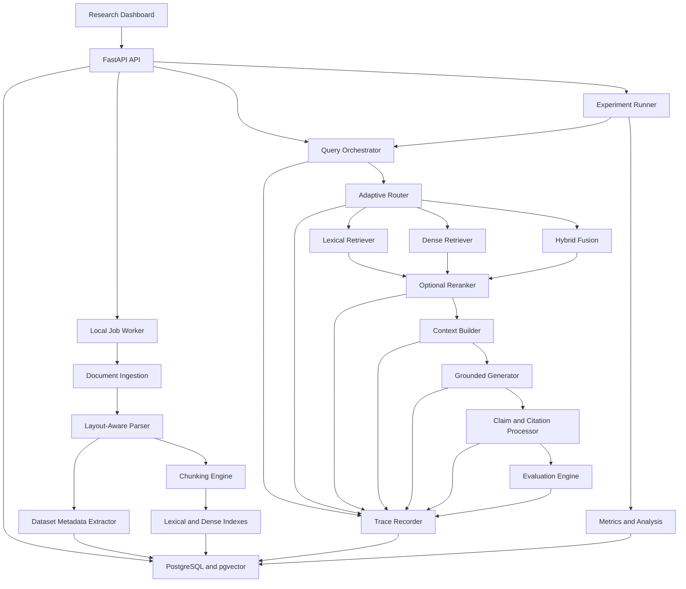

# RAGScope: Complete Project Definition and Implementation Specification

## Document Purpose

This document defines the complete RAGScope project. It is written as a source specification that can later be given to an LLM to generate focused implementation prompts for a coding agent.

The document should be treated as the project's source of truth. An implementation agent should not silently alter core requirements, research conditions, metric definitions, security boundaries, or data contracts. If a requirement proves infeasible, the agent should report the conflict and propose a documented change instead of quietly replacing it.

The specification contains:

- Project purpose and research contribution
- Scope and exclusions
- User roles and use cases
- System architecture
- Every major feature as a separate subsystem
- Data models and interfaces
- Retrieval and generation pipelines
- Evaluation methodology
- Benchmark construction
- Security and privacy requirements
- Testing requirements
- Implementation phases
- Work packages suitable for conversion into agent prompts
- Completion criteria

---

# 1. Project Identity

## 1.1 Project name

**RAGScope**

## 1.2 Full title

**RAGScope: An Observable and Adaptive Retrieval-Augmented Generation Evaluation Platform for Scientific Dataset Discovery**

## 1.3 One-sentence description

RAGScope is a research platform that ingests scientific papers and dataset documentation, runs questions through multiple retrieval-augmented generation pipelines, exposes the evidence path of every answer, and evaluates which retrieval and generation decisions cause success or failure.

## 1.4 Primary research question

> How do retrieval strategy, reranking, context construction, and adaptive routing affect evidence retrieval, answer faithfulness, citation quality, latency, and cost in scientific-document RAG?

## 1.5 Secondary research questions

- When does hybrid retrieval outperform dense retrieval?
- When does lexical retrieval outperform embedding retrieval?
- Does reranking improve evidence completeness or only reorder already relevant results?
- How often does a generator ignore highly ranked evidence?
- How does increasing the number of retrieved chunks affect correctness and hallucination?
- Can adaptive routing reduce retrieval and generation cost without reducing answer quality?
- Can the system recognize questions that are not answerable from the corpus?
- Which failures originate in document parsing, retrieval, reranking, context assembly, or generation?
- How accurately do generated citations support individual answer claims?
- How do contradictory, outdated, or highly similar documents affect the answer?
- Does layout-aware scientific-document parsing improve answers involving tables and structured metadata?

## 1.6 Project motivation

Many RAG applications are evaluated only by showing that they can answer questions over uploaded documents. That does not reveal:

- Whether the correct evidence was retrieved
- Whether all required evidence was retrieved
- Whether retrieved evidence was actually used
- Whether the model introduced unsupported claims
- Whether citations support the claims attached to them
- Which pipeline stage caused a failure
- Whether a more complex pipeline justifies its additional latency and cost

RAGScope treats a RAG system as an observable experimental pipeline rather than a black-box chatbot.

---

# 2. MITACS Application Alignment

RAGScope is designed to provide concrete preparation for the following shortlisted research themes.

## 2.1 Project 51780: AI Agent System for Data Engineering

Relevant RAGScope capabilities:

- Document ingestion and indexing
- Multiple retrieval methods
- RAG pipeline construction
- Adaptive routing
- Structured data extraction
- Experimental comparison of pipeline configurations
- Accuracy, efficiency, latency, and usability evaluation

## 2.2 Project 51785: LLM-Assisted Discovery of Emotion Datasets

Relevant RAGScope capabilities:

- Scientific PDF parsing
- Dataset metadata extraction
- Schema validation
- Human review
- Search and comparison of datasets
- Source provenance
- Evidence-grounded field extraction

## 2.3 Project 51202: LLM-Powered Intelligent Educational Systems

Relevant RAGScope capabilities:

- Knowledge retrieval over educational material
- Optional knowledge-graph retrieval
- Multi-document synthesis
- Adaptive retrieval
- Evidence-backed explanations

## 2.4 Project 53038: Observability and Trust in Agentic AI

Relevant RAGScope capabilities:

- Structured query traces
- Stage-level latency and cost
- Retrieval-decision visualization
- Failure classification
- Evidence-use analysis
- Reproducible evaluation

## 2.5 Project 54220: LLM-Driven Cybersecurity and Privacy

Relevant RAGScope capabilities:

- Distractor and conflicting-document experiments
- Optional corpus-poisoning extension
- Source trust metadata
- Guardrails for retrieved instructions
- Reproducible reliability testing

## 2.6 Project 54031: Secure and Reliable AI-Enabled Systems

Relevant RAGScope capabilities:

- Local document processing where practical
- Structured knowledge base
- Model-provider abstraction
- Evidence verification
- Reliability and latency measurement

---

# 3. Core Product Principles

The following principles are implementation invariants.

## 3.1 Evidence before fluency

An answer that sounds good but lacks supporting evidence is a failed answer. The interface and metrics must prioritize correctness, evidence coverage, and citation validity over writing style.

## 3.2 Retrieval and generation are evaluated separately

The platform must distinguish:

- Evidence not retrieved
- Evidence retrieved but omitted from the context
- Evidence included in context but ignored by the generator
- Evidence used incorrectly
- Unsupported information added during generation

## 3.3 Every result must be traceable

Every answer must be linked to:

- Pipeline configuration
- Corpus version
- Query version
- Retrieved chunks
- Ranking scores
- Context sent to the model
- Model configuration
- Generated claims
- Citations
- Evaluation results

## 3.4 Research conditions must be reproducible

Experiments must be configuration-driven. Model settings, retrieval settings, corpus versions, prompt versions, and code commit identifiers must be recorded.

## 3.5 Complexity must earn its cost

Hybrid retrieval, reranking, query rewriting, GraphRAG, and adaptive routing must be evaluated against simpler baselines. They must not be assumed to be improvements.

## 3.6 Human labels are the primary ground truth

LLM-as-judge evaluation may be used as a secondary metric, but primary retrieval evidence and answerability labels must come from human-created benchmark annotations.

## 3.7 The system is an evaluation platform, not a general autonomous agent

RAGScope should not gain unrelated tools, autonomous web browsing, email access, code execution, or multi-agent orchestration.

---

# 4. Scope

## 4.1 Required core scope

The complete core system must include:

- Scientific PDF and Markdown ingestion
- Layout-aware document representation
- Document, section, page, and chunk provenance
- Dataset metadata extraction
- Manual metadata correction
- Corpus versioning
- Benchmark question and evidence annotation
- Lexical retrieval
- Dense retrieval
- Hybrid retrieval
- Optional reranking as a configurable stage
- Adaptive pipeline routing
- Context construction
- Grounded answer generation
- Claim-level citation output
- Unanswerable-question handling
- Structured query traces
- Side-by-side pipeline comparison
- Retrieval and generation metrics
- Experiment runner
- Results analysis and export
- Local web interface
- Automated tests
- Research report inputs and figures

## 4.2 Optional extensions

Optional extensions must not delay the core experiment:

- GraphRAG
- Multi-turn conversational RAG
- Corpus-poisoning benchmark
- Local small-language-model inference
- Multimodal figure retrieval
- Text-to-SQL tools
- User accounts
- Cloud deployment
- Real-time collaborative annotation

## 4.3 Explicit exclusions

The initial implementation will not include:

- Training an embedding model from scratch
- Fine-tuning a large language model
- A production-scale web crawler
- Automatic ingestion of arbitrary copyrighted corpora
- Medical or legal advice
- Autonomous changes to source documents
- A claim that the evaluation covers all domains or all models
- A claim that LLM confidence is calibrated probability
- A general-purpose chat assistant

---

# 5. Target Users and User Roles

## 5.1 Researcher

The primary user. A researcher can:

- Create and version a corpus
- Upload documents
- Inspect parsed documents
- Configure retrieval pipelines
- Create benchmark questions
- Annotate evidence
- Run experiments
- Compare pipelines
- Inspect failures
- Export results

## 5.2 Annotator

An annotator can:

- Review parsed documents
- Correct dataset metadata
- Create questions
- Mark supporting passages
- Mark answerability
- Record reference answers
- Review generated claims and citations

For the local single-user version, Researcher and Annotator do not require separate authentication. The roles describe workflows, not mandatory account permissions.

## 5.3 Viewer

A viewer can:

- Browse completed experiment results
- Inspect traces
- Compare pipelines
- Read document and dataset summaries

---

# 6. Primary User Stories

## US-001: Create a corpus

As a researcher, I want to create a named, versioned corpus so that all experiments identify the exact document collection used.

## US-002: Ingest a scientific paper

As a researcher, I want to upload a PDF and inspect its parsed structure so that extraction mistakes are visible before indexing.

## US-003: Extract dataset metadata

As an annotator, I want RAGScope to propose structured dataset records with evidence passages so that I can correct and approve them efficiently.

## US-004: Configure a pipeline

As a researcher, I want to select retrieval, reranking, context, and generation settings so that I can compare RAG architectures reproducibly.

## US-005: Ask an exploratory question

As a researcher, I want to run one question through a pipeline and inspect every intermediate stage.

## US-006: Compare pipelines

As a researcher, I want to run the same question through several pipelines and view differences in evidence, answer, citations, latency, and cost.

## US-007: Build a benchmark

As an annotator, I want to create questions and label required evidence so that retrieval can be evaluated independently of generation.

## US-008: Run an experiment

As a researcher, I want to execute a frozen configuration across a benchmark so that results are repeatable.

## US-009: Diagnose failure

As a researcher, I want a failed answer classified by pipeline stage so that I can understand whether parsing, retrieval, context, or generation caused it.

## US-010: Export results

As a researcher, I want raw traces and tidy metrics exported as JSON and CSV so that analysis can be reproduced outside the application.

---

# 7. Recommended Technology Stack

The stack is recommended rather than absolutely mandatory. Any substitution must preserve the defined interfaces and research behaviour.

## 7.1 Backend

- Python 3.12 or later
- FastAPI
- Pydantic
- SQLAlchemy
- Alembic
- Background job abstraction suitable for local execution

For the initial system, a database-backed job table and local worker are sufficient. A distributed queue is unnecessary.

## 7.2 Database

- PostgreSQL
- `pgvector` for dense embeddings
- PostgreSQL full-text search for the first lexical-retrieval implementation

This keeps structured metadata, traces, lexical search, and vector search in one system. If PostgreSQL full-text search proves insufficient for the benchmark, a BM25 library or dedicated engine may be added behind the lexical-retriever interface.

## 7.3 Document parsing

- Docling or an equivalent layout-aware parser
- PDF, Markdown, and plain-text inputs
- Pydantic models for normalized document structure

Docling is a suitable starting point because it provides document hierarchy, tables, layout coordinates, and provenance information.

## 7.4 Retrieval and machine learning

- Provider-independent embedding interface
- One default embedding model
- Optional cross-encoder reranker
- scikit-learn, NumPy, pandas
- NetworkX for an optional small GraphRAG implementation

## 7.5 LLM integration

- Provider-independent chat/generation interface
- Structured output where supported
- Fixed or low temperature for experiments
- Token and cost recording
- Prompt-template versioning

## 7.6 Frontend

- Next.js
- TypeScript
- A stable UI component system
- PDF or document preview
- Charts for experiment results
- Accessible table and trace components

## 7.7 Development and testing

- pytest
- Ruff
- mypy
- Playwright for critical frontend flows
- Docker Compose for local services
- Pre-commit hooks if practical

---

# 8. High-Level Architecture



---

# 9. Repository Structure

The project should use a structure similar to:

```text
ragscope/
├── backend/
│   ├── app/
│   │   ├── api/
│   │   ├── core/
│   │   ├── db/
│   │   ├── documents/
│   │   ├── extraction/
│   │   ├── indexing/
│   │   ├── retrieval/
│   │   ├── reranking/
│   │   ├── routing/
│   │   ├── context/
│   │   ├── generation/
│   │   ├── citations/
│   │   ├── evaluation/
│   │   ├── experiments/
│   │   ├── tracing/
│   │   ├── artifacts/
│   │   └── workers/
│   └── tests/
├── frontend/
│   ├── app/
│   ├── components/
│   ├── features/
│   ├── lib/
│   └── tests/
├── benchmark/
│   ├── questions/
│   ├── annotations/
│   └── fixtures/
├── experiments/
│   ├── configurations/
│   ├── raw/
│   ├── derived/
│   └── notebooks/
├── prompts/
├── docs/
│   ├── architecture/
│   ├── literature/
│   ├── methodology/
│   └── report/
├── scripts/
├── docker-compose.yml
├── .env.example
├── README.md
└── pyproject.toml
```

Generated corpora, PDFs, embeddings, model responses, and experiment artifacts must be excluded from Git unless intentionally included as small redacted fixtures.

---

# 10. Core Data Model

All identifiers should use UUIDs unless the implementation has a documented reason to use another stable identifier.

## 10.1 Corpus

Represents a logical collection of documents.

Fields:

- `id`
- `name`
- `description`
- `domain`
- `created_at`
- `updated_at`

## 10.2 CorpusVersion

Represents an immutable document/index snapshot.

Fields:

- `id`
- `corpus_id`
- `version_label`
- `status`: `draft`, `indexing`, `ready`, `failed`, or `archived`
- `document_count`
- `content_hash`
- `parser_configuration`
- `chunker_configuration`
- `embedding_configuration`
- `created_at`
- `frozen_at`

Once frozen, a corpus version must not change. New documents or parsing changes create a new version.

## 10.3 SourceDocument

Fields:

- `id`
- `corpus_version_id`
- `title`
- `authors`
- `publication_year`
- `source_type`
- `source_uri`
- `license_information`
- `file_hash`
- `mime_type`
- `page_count`
- `parse_status`
- `parse_warnings`
- `created_at`

## 10.4 DocumentElement

Represents parsed document structure.

Fields:

- `id`
- `document_id`
- `parent_element_id`
- `element_type`: `title`, `heading`, `paragraph`, `list`, `table`, `caption`, `figure`, `formula`, or `other`
- `sequence_number`
- `page_number`
- `section_path`
- `text`
- `bounding_box`
- `parser_metadata`

## 10.5 Chunk

Fields:

- `id`
- `document_id`
- `corpus_version_id`
- `chunker_id`
- `sequence_number`
- `text`
- `token_count`
- `page_start`
- `page_end`
- `section_path`
- `source_element_ids`
- `content_hash`
- `metadata`

## 10.6 DatasetRecord

Represents a dataset described in a scientific document.

Fields:

- `id`
- `corpus_version_id`
- `name`
- `description`
- `domain`
- `modalities`
- `task_types`
- `instance_count`
- `participant_count`
- `annotation_types`
- `languages`
- `license`
- `access_url`
- `human_ratings`
- `collection_method`
- `known_limitations`
- `extraction_status`
- `review_status`

Every extracted field must be associated with one or more `FieldEvidence` records.

## 10.7 FieldEvidence

Fields:

- `id`
- `dataset_record_id`
- `field_name`
- `document_id`
- `page_number`
- `element_id`
- `chunk_id`
- `supporting_text`
- `extraction_method`
- `model_confidence_label`
- `review_status`
- `reviewer_note`

## 10.8 BenchmarkQuestion

Fields:

- `id`
- `benchmark_version_id`
- `question_text`
- `question_type`
- `difficulty`
- `answerable`
- `reference_answer`
- `answer_criteria`
- `required_document_ids`
- `required_chunk_ids`
- `acceptable_evidence_sets`
- `tags`
- `annotation_status`

## 10.9 PipelineConfiguration

Fields:

- `id`
- `name`
- `version`
- `retrieval_mode`
- `lexical_configuration`
- `dense_configuration`
- `fusion_configuration`
- `reranker_configuration`
- `router_configuration`
- `context_configuration`
- `generation_configuration`
- `citation_configuration`
- `prompt_versions`
- `created_at`
- `frozen_at`

## 10.10 QueryRun

Fields:

- `id`
- `corpus_version_id`
- `benchmark_question_id`, nullable for exploratory queries
- `pipeline_configuration_id`
- `query_text`
- `rewritten_query`
- `status`
- `route_decision`
- `answer_text`
- `answerability_decision`
- `started_at`
- `finished_at`
- `total_latency_ms`
- `input_tokens`
- `output_tokens`
- `estimated_cost`
- `failure_code`

## 10.11 RetrievalResult

Fields:

- `id`
- `query_run_id`
- `retriever_type`
- `chunk_id`
- `original_rank`
- `original_score`
- `normalized_score`
- `fused_rank`
- `reranked_rank`
- `reranker_score`
- `selected_for_context`

## 10.12 GeneratedClaim

Fields:

- `id`
- `query_run_id`
- `sequence_number`
- `claim_text`
- `claim_type`
- `citation_ids`
- `support_status`: `supported`, `partially_supported`, `unsupported`, `contradicted`, or `not_evaluated`
- `verification_method`
- `verification_score`

## 10.13 Citation

Fields:

- `id`
- `query_run_id`
- `claim_id`
- `chunk_id`
- `document_id`
- `page_number`
- `quoted_or_referenced_text`
- `entailment_status`
- `entailment_score`

## 10.14 TraceSpan

Fields:

- `id`
- `query_run_id`
- `parent_span_id`
- `sequence_number`
- `span_type`
- `name`
- `status`
- `started_at`
- `finished_at`
- `latency_ms`
- `input_summary`
- `output_summary`
- `configuration_snapshot`
- `error_code`
- `artifact_ids`

## 10.15 EvaluationResult

Fields:

- `id`
- `query_run_id`
- `metric_name`
- `metric_scope`: `parsing`, `retrieval`, `context`, `generation`, `citation`, `cost`, or `overall`
- `metric_value`
- `metric_version`
- `evaluation_method`
- `details`

## 10.16 Experiment

Fields:

- `id`
- `name`
- `research_question`
- `corpus_version_id`
- `benchmark_version_id`
- `pipeline_configuration_ids`
- `repetitions`
- `status`
- `code_commit`
- `created_at`
- `frozen_at`
- `completed_at`

---

# 11. Feature A: Corpus and Version Management

## 11.1 Purpose

Corpus versioning ensures that experiments run against immutable document collections.

## 11.2 Functional requirements

### COR-001

The system must allow creation of a named corpus with description and domain.

### COR-002

The system must allow creation of draft corpus versions.

### COR-003

Documents may be added or removed only while a corpus version is in `draft` state.

### COR-004

Freezing a corpus version must calculate a stable content hash covering document hashes and relevant parsing/indexing configurations.

### COR-005

A frozen corpus version must be immutable.

### COR-006

Reprocessing documents with changed parser, chunker, or embedding settings must create a new corpus version.

### COR-007

Every query run and experiment must reference exactly one corpus version.

## 11.3 Interface requirements

The corpus screen must show:

- Corpus name and description
- Versions
- Version state
- Document count
- Content hash
- Parser version
- Chunker version
- Embedding model
- Indexing status
- Creation and freeze dates

## 11.4 Acceptance criteria

- A frozen corpus cannot be edited through either UI or API.
- Two identical corpus builds produce the same content hash.
- A changed document or configuration produces a different version hash.
- A query cannot run against an unready corpus version.

---

# 12. Feature B: Scientific Document Ingestion

## 12.1 Purpose

Convert source files into a normalized, provenance-preserving document representation suitable for chunking, extraction, retrieval, and visual inspection.

## 12.2 Supported input

Required:

- PDF
- Markdown
- Plain text

Optional:

- HTML
- DOCX
- Dataset-card JSON or YAML

## 12.3 Ingestion workflow

1. Validate file type and size.
2. Calculate file hash.
3. Detect duplicates within the corpus version.
4. Store the original artifact.
5. Parse document structure.
6. Extract title, authors, year, headings, paragraphs, tables, captions, and page provenance where available.
7. Record parsing warnings.
8. Present a document-preview screen.
9. Permit manual correction of document-level metadata.
10. Mark the document ready for extraction and chunking.

## 12.4 Functional requirements

### ING-001

The system must reject unsupported or excessively large files with a clear error.

### ING-002

The system must preserve the original source file separately from parsed content.

### ING-003

Every parsed element must retain document, sequence, and page provenance where the source format provides it.

### ING-004

Tables must not be silently flattened without recording their structure or a warning.

### ING-005

Parsing failures must not create partially ready documents.

### ING-006

Duplicate file hashes must be reported before re-ingestion.

### ING-007

The user must be able to inspect raw parsed elements and their source pages.

## 12.5 Parsing quality checks

Detect and report:

- Empty pages
- Repeated headers and footers
- Suspicious reading order
- Broken words or encoding
- Missing page text
- Table extraction failures
- Unusually short or long sections
- OCR use

## 12.6 Acceptance criteria

- A representative scientific PDF can be parsed into ordered elements.
- Clicking a parsed element reveals its source page.
- The parser records warnings rather than hiding uncertainty.
- Re-ingesting the same file is deterministic under the same parser configuration.

---

# 13. Feature C: Dataset Metadata Extraction

## 13.1 Purpose

Extract searchable, structured dataset records from scientific papers while preserving field-level evidence and human review.

## 13.2 Extraction schema

The initial schema should include:

- Dataset name
- Description
- Domain
- Modalities
- Tasks supported
- Number of instances
- Number of participants
- Annotation type
- Human-ratings information
- Languages
- Collection method
- License
- Access URL
- Known limitations

Fields may be null when the document does not state them. The model must never invent a value merely to satisfy a schema.

## 13.3 Extraction strategies

The module must support at least two configurations:

- **Whole-document or section extraction baseline**
- **Retrieval-assisted field extraction**

Optional third configuration:

- **Retrieval plus field-level verification**

## 13.4 Functional requirements

### EXT-001

The output must validate against a Pydantic or JSON Schema model.

### EXT-002

Every non-null extracted field must have at least one evidence record.

### EXT-003

The extractor must support an explicit `not stated` result.

### EXT-004

Extraction status must distinguish valid syntax from reviewed factual correctness.

### EXT-005

The user must be able to accept, edit, reject, or clear each field.

### EXT-006

Manual corrections must preserve original model output and correction history.

### EXT-007

The user must be able to filter and compare approved dataset records.

## 13.5 Evaluation

Measure:

- Field exact match where appropriate
- Normalized field accuracy
- Evidence precision
- Evidence recall
- Missing-field rate
- Hallucinated-field rate
- Schema-validation rate
- Human correction count
- Human correction time

## 13.6 Acceptance criteria

- Invalid model output cannot enter the approved dataset catalog.
- Every approved field can be traced to evidence or a documented human assertion.
- Original extraction and reviewer correction remain distinguishable.
- The extraction benchmark can compare strategies on the same gold-standard papers.

---

# 14. Feature D: Chunking Engine

## 14.1 Purpose

Create retrieval units while retaining their relationship to original document structure.

## 14.2 Required chunkers

### Fixed-token chunker

Produces chunks of a configured token length with configured overlap.

### Structure-aware chunker

Uses headings, paragraphs, lists, and tables to avoid splitting coherent units unnecessarily.

## 14.3 Optional chunkers

- Sentence-window chunking
- Parent-child chunking
- Proposition or claim chunking

## 14.4 Functional requirements

### CHK-001

Every chunk must retain document, page, section, and source-element provenance.

### CHK-002

Chunker configuration must be serializable and versioned.

### CHK-003

The same input and configuration must produce identical chunks and hashes.

### CHK-004

Tables must remain identifiable as tables even if converted to text for embeddings.

### CHK-005

Chunk generation must record token counts.

### CHK-006

The interface must allow visual inspection of chunk boundaries.

## 14.5 Research variables

- Chunk size
- Overlap
- Structure awareness
- Inclusion of section titles
- Table serialization method
- Parent context inclusion

## 14.6 Acceptance criteria

- Chunk boundaries can be viewed against original document elements.
- No chunk loses its source-document identity.
- Experimental configurations can change chunking without changing application code.

---

# 15. Feature E: Indexing System

## 15.1 Purpose

Build reproducible lexical and dense indexes for every ready corpus version.

## 15.2 Lexical index

Required behaviour:

- Tokenize searchable chunk text.
- Support BM25 or a documented lexical-equivalent score.
- Support optional metadata filters.
- Return score and rank.

## 15.3 Dense index

Required behaviour:

- Generate one or more embeddings per chunk according to configuration.
- Store embedding model and dimension.
- Support cosine or documented similarity.
- Return score and rank.

## 15.4 Functional requirements

### IDX-001

Indexing must be tied to an immutable corpus version.

### IDX-002

Index records must identify embedding model and preprocessing version.

### IDX-003

Partial indexing failures must not mark the corpus ready.

### IDX-004

Indexing must be resumable or safely restartable.

### IDX-005

The system must report indexed chunk counts and failures.

### IDX-006

An index-integrity check must confirm that every indexed chunk belongs to the target corpus version.

## 15.5 Acceptance criteria

- Lexical and dense searches return deterministic rankings under fixed configuration.
- Switching embedding models requires a new index configuration.
- The application never mixes chunks from different corpus versions.

---

# 16. Feature F: Query Processing and Classification

## 16.1 Purpose

Normalize the user query and derive signals used by retrieval and routing.

## 16.2 Query categories

The initial classifier should support:

- Direct fact
- Dataset lookup
- Comparison
- Multi-document synthesis
- Multi-hop relationship
- Broad or exploratory
- Metadata filter
- Potentially unanswerable

## 16.3 Query processing stages

- Input validation
- Whitespace and encoding normalization
- Optional acronym expansion
- Optional query rewriting
- Query-type classification
- Entity and metadata-filter extraction
- Retrieval-need decision

## 16.4 Functional requirements

### QRY-001

The original query must always be preserved.

### QRY-002

Any rewritten query must be stored and displayed separately.

### QRY-003

Routing and classification outputs must include a concise reason and confidence label.

### QRY-004

The system must allow query rewriting to be disabled.

### QRY-005

Experimental runs must use a frozen query-processing configuration.

## 16.5 Acceptance criteria

- A user can see whether and how the query changed.
- Query classification never overwrites human benchmark labels.
- Query processing can be bypassed for baseline conditions.

---

# 17. Feature G: Retrieval Engines

## 17.1 Purpose

Retrieve candidate chunks using interchangeable strategies.

## 17.2 Required retrieval modes

### RET-NONE: No retrieval

The generator receives only the question and system instructions. This is a baseline, not a production mode.

### RET-LEXICAL: Lexical retrieval

Uses term matching and BM25-style ranking.

### RET-DENSE: Dense retrieval

Uses query and chunk embeddings.

### RET-HYBRID: Hybrid retrieval

Runs lexical and dense retrieval, then fuses ranked results.

## 17.3 Hybrid fusion

The initial implementation should support reciprocal rank fusion. Optional later methods may include weighted normalized-score fusion.

The system must retain:

- Original lexical rank and score
- Original dense rank and score
- Fusion contribution
- Final fused rank

## 17.4 Metadata filters

Support filters such as:

- Publication year
- Document
- Dataset domain
- Modality
- Language
- License availability

## 17.5 Functional requirements

### RET-001

All retrievers must implement a common interface.

### RET-002

Retrievers must return ranked chunk IDs, scores, and timing.

### RET-003

Top-k must be configuration-driven.

### RET-004

The complete candidate set must be stored before reranking.

### RET-005

Metadata filters must be recorded in the trace.

### RET-006

The system must support running multiple retrievers for the same query without repeating unrelated processing.

## 17.6 Acceptance criteria

- Lexical, dense, and hybrid modes can be evaluated with identical questions.
- Original and fused rankings remain inspectable.
- Retriever outputs never contain chunks outside the selected corpus version.

---

# 18. Feature H: Reranking

## 18.1 Purpose

Rerank a larger candidate set into a smaller, hopefully more relevant evidence set.

## 18.2 Required modes

- Reranking disabled
- Cross-encoder or equivalent relevance reranking enabled

## 18.3 Functional requirements

### RNK-001

The reranker must operate only on retrieved candidates.

### RNK-002

The original retrieval rank must never be overwritten.

### RNK-003

Reranker model, version, input format, and score must be recorded.

### RNK-004

Candidate count and final selected count must be separately configurable.

### RNK-005

Reranking latency must be measured independently.

## 18.4 Evaluation

Compare:

- Recall before reranking
- Precision after reranking
- Evidence completeness after selection
- Rank changes for required evidence
- Added latency
- Downstream answer quality

## 18.5 Acceptance criteria

- A trace shows exactly which chunks moved and why.
- Reranking can be disabled without changing the retriever.
- The experiment can show cases where reranking helps and cases where it hurts.

---

# 19. Feature I: Adaptive Router

## 19.1 Purpose

Choose a retrieval strategy based on query characteristics instead of always running the most expensive pipeline.

## 19.2 Initial routing decisions

The router may choose:

- No retrieval
- Lexical retrieval
- Dense retrieval
- Hybrid retrieval
- Whether query rewriting is enabled
- Whether reranking is enabled
- Candidate count
- Context budget

## 19.3 Router implementations

### Rule-based router

Required baseline using transparent rules based on query type, length, metadata filters, and lexical features.

### Model-based router

Optional implementation using an LLM or trained lightweight classifier.

## 19.4 Functional requirements

### ROU-001

Every routing decision must be structured and traceable.

### ROU-002

The router must include a reason code.

### ROU-003

The rule-based router must be deterministic.

### ROU-004

The router must not select a pipeline unavailable for the corpus version.

### ROU-005

An oracle route may be used only during analysis as an upper bound, never as a deployable result.

## 19.5 Router evaluation

Measure:

- Route accuracy against best observed pipeline
- End-to-end answer quality
- Retrieval calls avoided
- Reranking calls avoided
- Token reduction
- Cost reduction
- Latency reduction
- Quality loss relative to always-hybrid-plus-reranking

## 19.6 Acceptance criteria

- Every adaptive run identifies the chosen route.
- Router decisions can be replayed.
- Adaptive retrieval is compared against fixed pipelines rather than evaluated alone.

---

# 20. Feature J: Context Construction

## 20.1 Purpose

Transform ranked chunks into a bounded, well-labelled context for generation.

## 20.2 Context-building strategies

Required:

- Rank-order concatenation
- Deduplication of substantially overlapping chunks
- Source labels and stable citation identifiers
- Configurable token budget

Optional:

- Diversity-aware selection
- Parent-section expansion
- Evidence compression
- Query-focused summarization

## 20.3 Functional requirements

### CTX-001

The exact final context sent to the generator must be stored as an artifact.

### CTX-002

Every context block must have a stable citation identifier.

### CTX-003

Context construction must not change the factual text without recording a transformation.

### CTX-004

Deduplication decisions must be traceable.

### CTX-005

The builder must report chunks excluded because of the token budget.

### CTX-006

Documents must remain distinguishable even when multiple chunks are combined.

## 20.4 Research variables

- Top-k
- Context-token budget
- Chunk order
- Deduplication
- Source diversity
- Parent context
- Compression

## 20.5 Acceptance criteria

- The UI shows candidate chunks, selected chunks, and omitted chunks.
- The exact generator context can be exported.
- Citation identifiers map unambiguously to chunks and pages.

---

# 21. Feature K: Grounded Answer Generation

## 21.1 Purpose

Generate an answer that is restricted to retrieved evidence and explicitly abstains when evidence is insufficient.

## 21.2 Required answer structure

The generator should produce structured output similar to:

```json
{
  "answerability": "answerable",
  "answer": "The dataset contains ... [S1].",
  "claims": [
    {
      "text": "The dataset contains ...",
      "citations": ["S1"]
    }
  ],
  "limitations": [],
  "abstention_reason": null
}
```

Allowed answerability values:

- `answerable`
- `partially_answerable`
- `unanswerable`

## 21.3 Functional requirements

### GEN-001

The generator must use only citation identifiers that exist in the provided context.

### GEN-002

Factual claims must have citations.

### GEN-003

The generator must be instructed to abstain when required evidence is absent.

### GEN-004

Structured-output validation failures must be recorded and handled explicitly.

### GEN-005

Prompts must have immutable versions.

### GEN-006

Model name, parameters, token usage, latency, and provider request identifier must be stored where available.

### GEN-007

The system must preserve the raw model response separately from the parsed answer.

## 21.4 Prompt constraints

The generation prompt should:

- Clearly separate instructions from retrieved content
- Treat retrieved content as data, not instructions
- Require claim-level citations
- Permit uncertainty
- Permit partial answers
- Prohibit invented citations
- Prohibit reliance on unstated outside knowledge in evaluated RAG conditions

## 21.5 Acceptance criteria

- Invented citation IDs cause validation failure.
- Unsupported structured output is not silently accepted.
- An unanswerable benchmark question can produce an explicit abstention.
- Raw and parsed outputs remain available for audit.

---

# 22. Feature L: Claim and Citation Processing

## 22.1 Purpose

Convert the generated answer into individually evaluable claims and evidence links.

## 22.2 Claim processing

If the generator returns explicit claims, validate them. If claim segmentation is missing or invalid, use a separate deterministic or model-assisted segmentation step and record that method.

## 22.3 Citation validation levels

### Level 1: Citation existence

Does the cited identifier exist in the context?

### Level 2: Citation relevance

Is the cited passage about the subject of the claim?

### Level 3: Citation entailment

Does the cited passage support the claim?

### Level 4: Citation completeness

Do the citations collectively support all important parts of the claim?

## 22.4 Functional requirements

### CIT-001

Every citation must resolve to a chunk, document, and page where available.

### CIT-002

Claims with no citation must be marked unsupported unless they are explicitly non-factual interface text.

### CIT-003

Citation evaluation method and version must be recorded.

### CIT-004

Human review must be able to override automatic citation labels without deleting the original label.

### CIT-005

The UI must highlight claims and their supporting passages together.

## 22.5 Acceptance criteria

- Clicking a citation reveals the exact source passage.
- A citation to an unrelated chunk is distinguishable from a missing citation.
- Automatic and human citation judgments remain separately stored.

---

# 23. Feature M: Unanswerable and Contradictory Queries

## 23.1 Purpose

Evaluate whether RAGScope knows when available evidence is insufficient or conflicting.

## 23.2 Required scenarios

- No relevant document exists
- Relevant document exists but lacks the requested fact
- Only part of a multi-part question is answerable
- Sources disagree
- Sources describe different dataset versions
- The question contains a false premise

## 23.3 Functional requirements

### UNA-001

The generator must support partial and complete abstention.

### UNA-002

The system must not convert low retrieval score directly into a factual statement of absence.

### UNA-003

Conflicting passages must remain visible in the trace.

### UNA-004

The answer should identify disagreement without arbitrarily selecting a source unless a documented source policy applies.

## 23.4 Metrics

- Correct abstention rate
- Incorrect abstention rate
- Unsupported-answer rate
- Partial-answer accuracy
- Contradiction-detection rate
- False-premise recognition

## 23.5 Acceptance criteria

- The benchmark contains each required scenario.
- An answer can state that evidence conflicts and cite both sources.
- Answerability is evaluated independently from answer wording quality.

---

# 24. Feature N: Query Trace and Observability

## 24.1 Purpose

Record a structured execution trace that explains the observable pipeline path without claiming access to private model reasoning.

## 24.2 Trace hierarchy

```text
query_run
├── query_processing
│   ├── classification
│   └── rewriting
├── routing
├── retrieval
│   ├── lexical_retrieval
│   ├── dense_retrieval
│   └── fusion
├── reranking
├── context_construction
├── generation
├── claim_processing
├── citation_verification
└── evaluation
```

## 24.3 Functional requirements

### TRC-001

Each stage must record start, end, status, latency, and configuration.

### TRC-002

Large inputs and outputs must be stored as artifacts and referenced from spans.

### TRC-003

Errors must include stable error codes.

### TRC-004

Secrets and authorization data must be redacted before storage.

### TRC-005

The trace must distinguish user input, system instruction, retrieved content, and model output.

### TRC-006

Trace export must be available as versioned JSON.

### TRC-007

The trace must never be labelled as chain-of-thought or internal reasoning.

## 24.4 Derived trace summaries

- Total latency
- Latency by stage
- Cost by model call
- Retrieval candidate count
- Selected-context count
- Evidence lost at each stage
- Required evidence rank movement
- Unsupported claim count
- Failure stage

## 24.5 Acceptance criteria

- A failed answer can be reconstructed from stored observable artifacts.
- Stage durations sum consistently with total runtime, allowing minor overhead.
- Exported traces do not contain configured secrets.

---

# 25. Feature O: Side-by-Side Pipeline Comparison

## 25.1 Purpose

Let researchers compare the same question across multiple frozen pipeline configurations.

## 25.2 Comparison workflow

1. Select corpus version.
2. Enter or select a benchmark question.
3. Select two to four pipeline configurations.
4. Run configurations.
5. Display results in aligned columns.
6. Highlight ranking, context, answer, citation, latency, and cost differences.

## 25.3 Required comparison views

- Route decision
- Query rewrite
- Retrieved documents
- Required-evidence ranks
- Reranker movement
- Final context
- Answer
- Claim support
- Citations
- Metrics
- Cost and latency

## 25.4 Functional requirements

### CMP-001

All compared runs must use the same corpus version and original question.

### CMP-002

Configuration differences must be displayed explicitly.

### CMP-003

The interface must not declare a universal winner based on a single question.

### CMP-004

Differences in missing or retrieved evidence must be visually identifiable.

## 25.5 Acceptance criteria

- A researcher can explain why two pipelines produced different answers.
- Comparison results retain links to complete individual traces.
- Costs and latencies use the same units and definitions.

---

# 26. Feature P: Benchmark Authoring and Annotation

## 26.1 Purpose

Create a high-quality evaluation set with human-labelled evidence and answerability.

## 26.2 Question types

The benchmark should contain:

- Direct fact lookup
- Dataset discovery
- Dataset comparison
- Multi-document synthesis
- Multi-hop reasoning
- Table-based questions
- Broad summary questions
- Ambiguous questions
- Unanswerable questions
- False-premise questions
- Contradictory-source questions
- Distractor-sensitive questions

## 26.3 Annotation workflow

1. Select source document or documents.
2. Write a natural question.
3. Assign question type and difficulty.
4. Mark whether it is answerable.
5. Write a reference answer or explicit answer criteria.
6. Highlight all required evidence passages.
7. Identify acceptable alternative evidence sets.
8. Add annotation notes.
9. Validate that the question does not reveal the answer.
10. Mark the annotation reviewed.

## 26.4 Functional requirements

### BEN-001

Every answerable question must have at least one acceptable evidence set.

### BEN-002

Every unanswerable question must include an explanation of why it is unanswerable.

### BEN-003

Benchmark versions must be immutable after freezing.

### BEN-004

Changing a question or annotation after freezing must create a new benchmark version.

### BEN-005

The annotation interface must show document text and page provenance.

### BEN-006

Question leakage checks must flag questions that copy the answer passage too directly.

## 26.5 Dataset target

The final primary benchmark should contain approximately 75–100 questions. A minimum viable research benchmark may contain 50 carefully annotated questions if time is constrained.

Recommended distribution:

- 15 direct facts
- 10 dataset-discovery questions
- 10 comparisons
- 10 multi-document or multi-hop questions
- 5 table questions
- 10 broad synthesis questions
- 10 unanswerable or false-premise questions
- 5 contradictory or distractor-sensitive questions

## 26.6 Acceptance criteria

- The benchmark can evaluate retrieval without running a generator.
- Evidence annotations map to stable corpus chunks or elements.
- Frozen benchmark versions are reproducible.

---

# 27. Feature Q: Evaluation Engine

## 27.1 Purpose

Calculate reproducible stage-level and end-to-end metrics.

## 27.2 Retrieval metrics

Required:

- Recall@k
- Precision@k
- Reciprocal rank
- nDCG@k
- Evidence-set completeness
- Required-document recall

Definitions must be documented in code and methodology.

## 27.3 Context metrics

- Context precision
- Context recall
- Required evidence retained after token budgeting
- Redundancy rate
- Source diversity
- Context token count

## 27.4 Generation metrics

Primary or human-labelled where possible:

- Answer correctness
- Answer completeness
- Appropriate abstention
- Unsupported-claim count
- Contradiction count

Secondary automated metrics:

- Semantic similarity to reference answer
- Model-judged correctness
- Model-judged faithfulness

Automated judge prompts and models must be versioned.

## 27.5 Citation metrics

- Citation existence rate
- Citation precision
- Citation recall
- Claim support rate
- Citation completeness

## 27.6 Operational metrics

- Total latency
- Stage latency
- Input tokens
- Output tokens
- Estimated monetary cost
- Retrieval calls
- Reranking calls
- Model calls
- Failure rate

## 27.7 Functional requirements

### EVA-001

Metric implementations must be versioned.

### EVA-002

Human and model-judged metrics must remain distinguishable.

### EVA-003

Missing evaluation data must be represented as missing, not zero.

### EVA-004

Metrics must be computable for one run and in batch.

### EVA-005

The engine must expose detailed inputs used for every metric.

### EVA-006

Primary experiment conclusions must not depend exclusively on an LLM judge.

## 27.8 Acceptance criteria

- Retrieval metrics pass tests using hand-calculated examples.
- Re-running metrics on identical stored artifacts produces identical results.
- Metric versions appear in exports.

---

# 28. Feature R: Failure Attribution

## 28.1 Purpose

Classify observable failure causes instead of reporting only an incorrect final answer.

## 28.2 Failure taxonomy

### Parsing failures

- `PARSE_MISSING_CONTENT`
- `PARSE_READING_ORDER`
- `PARSE_TABLE_FAILURE`
- `PARSE_ENCODING_FAILURE`

### Retrieval failures

- `RETRIEVAL_TOTAL_MISS`
- `RETRIEVAL_PARTIAL_EVIDENCE`
- `RETRIEVAL_WRONG_DOCUMENT`
- `RETRIEVAL_DISTRACTOR_DOMINANCE`

### Reranking failures

- `RERANK_REQUIRED_EVIDENCE_DEMOTED`
- `RERANK_IRRELEVANT_EVIDENCE_PROMOTED`

### Context failures

- `CONTEXT_REQUIRED_EVIDENCE_DROPPED`
- `CONTEXT_EXCESSIVE_REDUNDANCY`
- `CONTEXT_CONFLICT_UNMANAGED`

### Generation failures

- `GENERATION_IGNORED_EVIDENCE`
- `GENERATION_UNSUPPORTED_CLAIM`
- `GENERATION_CONTRADICTED_EVIDENCE`
- `GENERATION_INCOMPLETE_ANSWER`
- `GENERATION_FAILED_TO_ABSTAIN`
- `GENERATION_INCORRECT_ABSTENTION`

### Citation failures

- `CITATION_MISSING`
- `CITATION_INVALID_ID`
- `CITATION_IRRELEVANT`
- `CITATION_PARTIAL_SUPPORT`

### Infrastructure failures

- `MODEL_PROVIDER_FAILURE`
- `EMBEDDING_PROVIDER_FAILURE`
- `DATABASE_FAILURE`
- `TIMEOUT`
- `INVALID_STRUCTURED_OUTPUT`

## 28.3 Attribution rules

Failure attribution should use observable evidence:

- If required evidence was not in retrieved top-k, classify retrieval failure.
- If required evidence was retrieved but removed during reranking, classify reranking failure.
- If required evidence survived reranking but was omitted by context budgeting, classify context failure.
- If required evidence was in context but the answer was wrong or unsupported, classify generation failure.
- Infrastructure failures must not be counted as model-quality failures.

## 28.4 Functional requirements

### FAL-001

A failed run may have one primary and multiple secondary failure labels.

### FAL-002

Automatic labels must include the rule or evidence used.

### FAL-003

Human reviewers may correct labels without deleting automatic labels.

### FAL-004

Failure-taxonomy versions must be recorded.

## 28.5 Acceptance criteria

- Synthetic fixture runs trigger expected failure categories.
- The system distinguishes retrieval miss from generator misuse.
- Infrastructure failures are excluded from answer-quality denominators by an explicit documented rule.

---

# 29. Feature S: Experiment Runner

## 29.1 Purpose

Execute controlled comparisons over frozen corpus and benchmark versions.

## 29.2 Experiment configuration

Example:

```yaml
experiment_id: ragscope-main-v1
corpus_version: scientific-datasets-v1
benchmark_version: dataset-qa-v1
pipelines:
  - no-rag-v1
  - lexical-v1
  - dense-v1
  - hybrid-rerank-v1
  - adaptive-v1
repetitions: 1
generation_model: selected-model-version
temperature: 0
max_output_tokens: 800
stop_on_error: false
```

## 29.3 Functional requirements

### EXP-001

An experiment must reference frozen corpus, benchmark, and pipeline versions.

### EXP-002

The runner must create one independent query run per question, pipeline, and repetition.

### EXP-003

The runner must be resumable.

### EXP-004

Completed valid runs must not be duplicated during resume.

### EXP-005

Infrastructure failures must be retryable under a documented policy.

### EXP-006

Prompt or configuration changes require a new experiment identifier.

### EXP-007

The runner must estimate maximum expected cost before execution when provider pricing data is configured.

### EXP-008

Raw artifacts must be immutable after experiment completion.

## 29.4 Pilot requirement

Before the main experiment, run:

- At least five questions
- At least three pipeline configurations
- Manual trace inspection
- Manual metric verification
- Cost and latency validation

## 29.5 Acceptance criteria

- Interrupted experiments resume without corrupting results.
- Every run identifies code, corpus, benchmark, pipeline, prompt, and model versions.
- Raw results and derived analysis tables remain separate.

---

# 30. Feature T: Analysis and Results Dashboard

## 30.1 Purpose

Turn experiment results into understandable comparisons and failure evidence.

## 30.2 Required aggregate views

- Pipeline resolution or correctness rate
- Retrieval Recall@k
- Evidence completeness
- Unsupported-claim rate
- Citation precision and recall
- Abstention performance
- Median latency
- Median token use
- Median cost
- Failure-category distribution
- Results by question type
- Results by difficulty

## 30.3 Required figures

1. Retrieval Recall@k by pipeline
2. Answer correctness by pipeline
3. Citation support rate by pipeline
4. Cost versus answer correctness
5. Latency distribution
6. Failure stage distribution
7. Performance by query type
8. Required-evidence survival through retrieval, reranking, and context selection

## 30.4 Functional requirements

### ANA-001

Every chart must display or reveal sample size.

### ANA-002

Filters must not silently change metric denominators.

### ANA-003

Infrastructure failures must be separately visible.

### ANA-004

Aggregate results must link to contributing runs.

### ANA-005

Results must be exportable as tidy CSV and versioned JSON.

### ANA-006

The dashboard must avoid presenting small-sample differences as universal conclusions.

## 30.5 Acceptance criteria

- Every aggregate value can be traced to raw query runs.
- Exported tables can reproduce the main report figures.
- Question-type filters work consistently.

---

# 31. User Interface Sections

## 31.1 Home dashboard

Show:

- Corpus count
- Ready corpus versions
- Benchmark versions
- Recent query runs
- Active or completed experiments
- High-level latest experiment summary

## 31.2 Corpus manager

- Corpus and version list
- Document upload
- Parsing status
- Indexing status
- Freeze version action
- Configuration summary

## 31.3 Document inspector

- Original PDF preview
- Parsed hierarchy
- Page navigation
- Tables and captions
- Parser warnings
- Chunk overlays
- Dataset extraction records

## 31.4 Dataset catalog

- Structured search
- Filters
- Dataset comparison
- Field evidence
- Review status
- JSON export

## 31.5 Pipeline builder

- Retrieval mode
- Top-k
- Embedding model
- Fusion method
- Reranker
- Context budget
- Generation model
- Prompt version
- Save and freeze configuration

The builder should expose valid choices rather than arbitrary executable configuration.

## 31.6 Query laboratory

- Question input
- Corpus selection
- Pipeline selection
- Run button
- Trace timeline
- Retrieved candidates
- Ranking changes
- Final context
- Answer and citations
- Metrics

## 31.7 Pipeline comparison

- Aligned multi-column results
- Evidence overlap
- Required-evidence rank
- Context difference
- Answer difference
- Claim support
- Cost and latency

## 31.8 Benchmark editor

- Question form
- Type and difficulty
- Answerability
- Reference answer
- Document viewer
- Evidence highlighting
- Annotation review
- Version freeze

## 31.9 Experiment manager

- Configuration
- Cost estimate
- Progress
- Run counts
- Failure counts
- Resume action
- Freeze status

## 31.10 Results dashboard

- Aggregate metrics
- Charts
- Filters
- Failure analysis
- Run drill-down
- Export

---

# 32. API Surface

Exact routes may change, but the following resources and operations must exist.

## 32.1 Corpora

- `POST /corpora`
- `GET /corpora`
- `GET /corpora/{corpus_id}`
- `POST /corpora/{corpus_id}/versions`
- `GET /corpus-versions/{version_id}`
- `POST /corpus-versions/{version_id}/freeze`

## 32.2 Documents

- `POST /corpus-versions/{version_id}/documents`
- `GET /documents/{document_id}`
- `GET /documents/{document_id}/elements`
- `POST /documents/{document_id}/parse`
- `GET /documents/{document_id}/artifacts`

## 32.3 Dataset records

- `POST /documents/{document_id}/extract-datasets`
- `GET /dataset-records`
- `GET /dataset-records/{record_id}`
- `PATCH /dataset-records/{record_id}`
- `POST /dataset-records/{record_id}/review`

## 32.4 Indexing

- `POST /corpus-versions/{version_id}/chunk`
- `POST /corpus-versions/{version_id}/index`
- `GET /corpus-versions/{version_id}/index-status`

## 32.5 Pipelines

- `POST /pipeline-configurations`
- `GET /pipeline-configurations`
- `GET /pipeline-configurations/{id}`
- `POST /pipeline-configurations/{id}/freeze`

## 32.6 Queries

- `POST /query-runs`
- `GET /query-runs/{run_id}`
- `GET /query-runs/{run_id}/trace`
- `GET /query-runs/{run_id}/retrieval-results`
- `GET /query-runs/{run_id}/claims`
- `GET /query-runs/{run_id}/evaluation`
- `POST /query-comparisons`

## 32.7 Benchmarks

- `POST /benchmarks`
- `POST /benchmarks/{id}/versions`
- `POST /benchmark-versions/{id}/questions`
- `PATCH /benchmark-questions/{id}`
- `POST /benchmark-questions/{id}/evidence`
- `POST /benchmark-versions/{id}/freeze`

## 32.8 Experiments

- `POST /experiments`
- `POST /experiments/{id}/estimate`
- `POST /experiments/{id}/start`
- `POST /experiments/{id}/resume`
- `GET /experiments/{id}`
- `GET /experiments/{id}/results`
- `GET /experiments/{id}/export`

All mutation endpoints must validate object state transitions.

---

# 33. Background Jobs

The following operations should execute as jobs:

- PDF parsing
- Dataset extraction
- Chunk generation for large corpora
- Embedding generation
- Index building
- Batch query experiments
- Automatic evaluation
- Export generation

Each job must have:

- Stable job ID
- Job type
- Input reference
- Status
- Progress counters
- Start and finish timestamps
- Retry count
- Error code and message
- Result artifact references

Jobs should be idempotent or protected against duplicate execution.

---

# 34. Artifact Management

Artifacts include:

- Original documents
- Parsed document JSON
- Extracted tables
- Chunk exports
- Raw model responses
- Final contexts
- Trace exports
- Experiment configurations
- Raw result exports
- Analysis tables
- Generated figures

Requirements:

- Store content hash.
- Store media type.
- Store producing operation and version.
- Never overwrite immutable experiment artifacts.
- Redact secrets before persistence.
- Prevent path traversal in local artifact access.

---

# 35. Configuration and Versioning

The following must be versioned:

- Parser configuration
- Chunker configuration
- Embedding configuration
- Retriever configuration
- Fusion method
- Reranker configuration
- Router configuration
- Context builder configuration
- Generation prompt
- Generation model parameters
- Citation verification method
- Metric implementation
- Failure taxonomy
- Corpus
- Benchmark
- Experiment

A configuration snapshot must contain actual values, not only a human-readable name.

---

# 36. Security and Privacy Requirements

## 36.1 File safety

- Validate extension and detected media type.
- Set file-size limits.
- Store uploads outside executable source directories.
- Sanitize filenames.
- Prevent archive traversal if archive support is later added.

## 36.2 Prompt-injection boundary

Retrieved documents must be treated as untrusted data.

Generation prompts must clearly separate:

- System instructions
- User question
- Retrieved evidence

Retrieved text must never be allowed to redefine system behaviour or request external actions.

## 36.3 Secrets

- API keys must come from environment variables or a local secret store.
- Keys must never appear in traces, frontend payloads, logs, or exports.
- `.env.example` must contain names only, not real values.

## 36.4 Database safety

- Use parameterized queries.
- Validate filters and sort fields.
- Apply limits to search and export endpoints.

## 36.5 Content and licensing

- Record source URI and available license information.
- Do not bundle large third-party paper collections in the public repository.
- Public fixtures should be openly licensed, synthetic, or sufficiently small and appropriate for testing.

## 36.6 Model data disclosure

The user must be able to identify which content is sent to an external model provider. Local-only parsing and embedding modes may be supported but must not be falsely implied when external APIs are used.

---

# 37. Non-Functional Requirements

## 37.1 Reproducibility

- Frozen configurations must be immutable.
- Raw experiment results must be preserved.
- Random seeds must be recorded where supported.
- Code commit identifiers must be stored for experiments.

## 37.2 Reliability

- Background jobs must report partial progress and controlled failure.
- Invalid model responses must not corrupt stored research data.
- A failed pipeline stage must terminate or degrade according to explicit policy.

## 37.3 Performance

Initial local targets:

- Corpus and benchmark pages should load without scanning raw artifacts.
- Search results should appear within a few seconds for the target corpus size.
- Query-stage latency must be measured rather than hidden.
- Long operations must use background jobs.

## 37.4 Accessibility

- Keyboard-accessible controls
- Visible focus states
- Status not communicated by colour alone
- Accessible chart labels or accompanying tables
- Readable document and citation highlights

## 37.5 Maintainability

- Retrieval engines implement a common interface.
- Model providers implement common interfaces.
- Metric definitions are isolated and tested.
- Domain models do not depend directly on a particular LLM framework.

---

# 38. Research Experiment Design

## 38.1 Primary experimental conditions

Recommended conditions:

### P0: No RAG

No document retrieval. Measures model prior knowledge and unsupported-answer behaviour.

### P1: Lexical RAG

BM25-style retrieval, no reranker.

### P2: Dense RAG

Embedding retrieval, no reranker.

### P3: Hybrid RAG

Lexical and dense retrieval with reciprocal rank fusion.

### P4: Hybrid RAG with reranking

Hybrid candidates followed by a cross-encoder reranker.

### P5: Adaptive RAG

Rule-based or model-based router selects a configured route.

GraphRAG should be a separate follow-up experiment unless it is completed without delaying these baselines.

## 38.2 Controlled variables

Where possible, hold constant:

- Corpus version
- Benchmark version
- Generator model
- Generation prompt
- Temperature
- Output-token limit
- Embedding model within dense/hybrid comparisons
- Candidate count
- Final context budget
- Evaluation methods

## 38.3 Primary hypotheses

- **H1:** Hybrid retrieval improves required-evidence recall over dense retrieval alone.
- **H2:** Reranking improves context precision but adds measurable latency.
- **H3:** Better retrieval recall does not always produce better answer correctness because generators may ignore or misuse evidence.
- **H4:** Larger context budgets eventually reduce context precision without consistently improving correctness.
- **H5:** Adaptive routing reduces average latency and cost relative to always using hybrid retrieval plus reranking while maintaining comparable answer quality.
- **H6:** Explicit abstention instructions improve unanswerable-question behaviour but may increase incorrect abstentions.

## 38.4 Ablation studies

Recommended ablations:

- Query rewriting on versus off
- Reranking on versus off
- Top-k values such as 3, 5, and 10
- Structure-aware versus fixed-size chunking
- Context deduplication on versus off
- Citation verification on versus off

Do not run a full combinatorial grid unless budget and time support it. Select ablations tied to the research questions.

## 38.5 Repetitions

If generation is nondeterministic and budget permits, use multiple repetitions. If only one run is used, clearly report that nondeterminism was not fully measured.

## 38.6 Exclusion policy

Exclude a run only for documented infrastructure reasons such as provider outage, corrupt artifact, database failure, or experiment-runner defect. Poor model performance is not an exclusion reason.

---

# 39. Testing Strategy

## 39.1 Unit tests

Required unit-test areas:

- Configuration validation
- Corpus immutability
- File hashing
- Parser normalization
- Chunk determinism
- Lexical ranking fixtures
- Vector filtering
- Reciprocal rank fusion
- Reranker rank preservation
- Context-budget enforcement
- Citation-ID validation
- Metric calculations
- Failure attribution
- Secret redaction
- Experiment resume logic

## 39.2 Integration tests

Required flows:

- Upload document through parsed elements
- Parse, chunk, embed, and search
- Run lexical query
- Run dense query
- Run hybrid query
- Generate structured answer with fake model
- Reject invalid citations
- Create and freeze benchmark
- Run small experiment
- Export results

## 39.3 End-to-end tests

At least these UI flows:

- Create corpus and upload document
- Inspect parsed document
- Create pipeline configuration
- Run query and inspect trace
- Compare two pipelines
- Create benchmark question and label evidence
- Run a fixture experiment and open results

## 39.4 Metric gold tests

For each retrieval and citation metric, create tiny hand-calculated fixtures. The test should state the expected value and why it is correct.

## 39.5 Model mocking

Most automated tests must use deterministic fake embedding, reranker, and generation providers. Real-provider smoke tests must be explicitly opt-in to avoid accidental cost.

## 39.6 Regression tests

When a parsing, ranking, trace, or metric bug is discovered, add a fixture reproducing it before or with the fix.

---

# 40. Error Codes

Use stable machine-readable error codes. Initial categories:

## Corpus and ingestion

- `CORPUS_VERSION_IMMUTABLE`
- `CORPUS_VERSION_NOT_READY`
- `UNSUPPORTED_FILE_TYPE`
- `FILE_TOO_LARGE`
- `DUPLICATE_DOCUMENT`
- `DOCUMENT_PARSE_FAILED`

## Indexing

- `CHUNKING_FAILED`
- `EMBEDDING_FAILED`
- `INDEX_BUILD_FAILED`
- `INDEX_VERSION_MISMATCH`

## Query pipeline

- `INVALID_QUERY`
- `ROUTE_UNAVAILABLE`
- `RETRIEVAL_FAILED`
- `RERANK_FAILED`
- `CONTEXT_BUILD_FAILED`
- `GENERATION_FAILED`
- `INVALID_STRUCTURED_OUTPUT`
- `INVALID_CITATION`
- `EVALUATION_FAILED`

## Experiment

- `EXPERIMENT_NOT_FROZEN`
- `EXPERIMENT_VERSION_CONFLICT`
- `EXPERIMENT_RUN_DUPLICATE`
- `EXPERIMENT_COST_LIMIT`

Every error should include a user-facing explanation and an internal diagnostic artifact where appropriate.

---

# 41. Implementation Phases

## Phase 0: Project contract and literature matrix

Deliverables:

- Final scope
- Research questions
- Hypotheses
- Literature matrix
- Terminology glossary
- Architecture decision record template

Exit criteria:

- Research and product goals are distinguishable.
- Core versus optional features are frozen.

## Phase 1: Engineering foundation

Deliverables:

- Repository structure
- Backend and frontend skeletons
- PostgreSQL and pgvector setup
- Typed settings
- Logging
- Test commands
- CI checks

Exit criteria:

- Services start locally.
- Health checks and database tests pass.

## Phase 2: Corpus, document, and artifact model

Deliverables:

- Corpus and version APIs
- Document upload
- Artifact storage
- Immutability logic
- Basic corpus interface

Exit criteria:

- A document can be safely attached to a draft corpus version.

## Phase 3: Parsing and document inspection

Deliverables:

- PDF and Markdown parsing
- Normalized elements
- Provenance
- Parser warnings
- Document inspector UI

Exit criteria:

- A scientific PDF can be visually compared with parsed elements.

## Phase 4: Chunking and indexing

Deliverables:

- Fixed and structure-aware chunkers
- Chunk inspector
- Lexical index
- Dense embeddings
- Index integrity checks

Exit criteria:

- The same corpus supports lexical and dense search.

## Phase 5: Retrieval and comparison foundations

Deliverables:

- Common retriever interface
- Lexical retriever
- Dense retriever
- Hybrid fusion
- Retrieval traces
- Search debug interface

Exit criteria:

- Rankings and scores are reproducible and inspectable.

## Phase 6: Reranking and context construction

Deliverables:

- Optional reranker
- Rank movement tracking
- Context builder
- Token budgets
- Deduplication
- Context inspection

Exit criteria:

- Candidate, reranked, selected, and excluded chunks remain distinguishable.

## Phase 7: Grounded generation and citations

Deliverables:

- Model-provider abstraction
- Prompt versioning
- Structured answers
- Claim and citation records
- Abstention
- Raw response storage

Exit criteria:

- A query produces a validated answer whose citations resolve to context chunks.

## Phase 8: Trace and query laboratory

Deliverables:

- Full trace hierarchy
- Query-run interface
- Stage timing and cost
- Claim/evidence view
- JSON trace export

Exit criteria:

- A researcher can reconstruct a complete query path.

## Phase 9: Dataset extraction and catalog

Deliverables:

- Dataset schema
- Baseline and retrieval-assisted extraction
- Field evidence
- Human review
- Dataset catalog and filters

Exit criteria:

- Approved dataset records contain reviewable evidence.

## Phase 10: Benchmark authoring

Deliverables:

- Benchmark and version model
- Question editor
- Evidence highlighting
- Answerability labels
- Freeze workflow

Exit criteria:

- A frozen benchmark can evaluate retrieval independently.

## Phase 11: Evaluation and failure attribution

Deliverables:

- Retrieval metrics
- Context metrics
- Citation metrics
- Answer metrics
- Failure taxonomy
- Human override workflows

Exit criteria:

- Fixture runs produce verified metric values and expected failure labels.

## Phase 12: Adaptive router

Deliverables:

- Rule-based router
- Route trace
- Fixed-versus-adaptive comparison
- Router metrics

Exit criteria:

- Adaptive runs are reproducible and compared against fixed baselines.

## Phase 13: Experiment runner

Deliverables:

- Frozen experiment configuration
- Cost estimation
- Batch execution
- Resume logic
- Immutable raw results

Exit criteria:

- A pilot experiment completes and resumes correctly after interruption.

## Phase 14: Analysis dashboard

Deliverables:

- Aggregate metrics
- Required charts
- Filters
- Run drill-down
- CSV and JSON export

Exit criteria:

- Dashboard values can be regenerated from exported raw results.

## Phase 15: Main research experiment

Deliverables:

- Frozen corpus and benchmark
- Frozen pipelines
- Completed valid runs
- Failure labels
- Analysis tables
- Figures

Exit criteria:

- All planned conditions are complete or transparently reported as missing.

## Phase 16: Quality assurance and documentation

Deliverables:

- Full test pass
- Reproducibility check
- Security review
- README
- Architecture documentation
- Methodology
- Research report
- Demonstration video

Exit criteria:

- A new developer can run the fixture workflow from the documentation.
- The report's numbers match stored results.

---

# 42. Agent Work Packages

These work packages are intentionally designed for conversion into separate coding-agent prompts. A prompt generator should create one or a small number of prompts per package, not one prompt for the entire project.

## WP-001: Initialize project structure

Scope:

- Backend, frontend, test, documentation, and experiment directories
- Development commands
- Environment example
- Docker Compose

Dependencies: None

Definition of done:

- Services start.
- Checks run.
- No feature implementation is invented.

## WP-002: Typed configuration and provider interfaces

Scope:

- Settings
- Embedding-provider protocol
- Generation-provider protocol
- Reranker protocol
- Fake deterministic providers

Dependencies: WP-001

Definition of done:

- Interfaces have unit tests.
- Tests need no external API.

## WP-003: Database foundation

Scope:

- SQLAlchemy base
- Initial migrations
- Core IDs and timestamps
- Session management

Dependencies: WP-001

Definition of done:

- Database initializes and migrations pass.

## WP-004: Corpus and version models

Scope:

- Corpus
- CorpusVersion
- State transitions
- Content hashing
- API tests

Dependencies: WP-003

Definition of done:

- Frozen versions reject mutation.

## WP-005: Artifact service

Scope:

- Safe local artifact paths
- Hashes
- Metadata
- Atomic writes
- Traversal protection

Dependencies: WP-003

Definition of done:

- Artifact security tests pass.

## WP-006: Document upload and metadata

Scope:

- SourceDocument model
- File validation
- Duplicate detection
- Upload API

Dependencies: WP-004, WP-005

Definition of done:

- Valid fixtures upload and invalid files fail clearly.

## WP-007: Document parser adapter

Scope:

- Parser interface
- Docling adapter
- Normalized elements
- Provenance
- Parsing warnings

Dependencies: WP-006

Definition of done:

- PDF and Markdown fixtures produce deterministic element records.

## WP-008: Document inspector UI

Scope:

- Document list
- Page/element view
- Parser warnings
- Basic PDF preview

Dependencies: WP-007

Definition of done:

- Parsed elements can be visually traced to source pages.

## WP-009: Chunker interfaces and fixed chunker

Scope:

- Chunk model
- Configuration
- Fixed-token chunker
- Hashing

Dependencies: WP-007

Definition of done:

- Chunk output is deterministic.

## WP-010: Structure-aware chunker

Scope:

- Section and paragraph boundaries
- Table handling
- Source-element mapping

Dependencies: WP-009

Definition of done:

- Fixtures demonstrate meaningful boundary differences from fixed chunking.

## WP-011: Chunk inspector UI

Scope:

- Chunk list
- Boundary visualization
- Metadata and token counts

Dependencies: WP-009, WP-010

Definition of done:

- Users can compare chunker outputs.

## WP-012: Lexical index and retriever

Scope:

- Lexical indexing
- Common retrieval result schema
- Top-k
- Filters
- Scores and ranks

Dependencies: WP-009, WP-003

Definition of done:

- Hand-built ranking fixtures pass.

## WP-013: Dense index and retriever

Scope:

- Embedding storage
- Batch embedding jobs
- Vector search
- Model/version metadata

Dependencies: WP-002, WP-009, WP-003

Definition of done:

- Fake embeddings support deterministic integration tests.

## WP-014: Hybrid fusion

Scope:

- Reciprocal rank fusion
- Score/rank preservation
- Configurable candidate counts

Dependencies: WP-012, WP-013

Definition of done:

- Fusion metric tests use hand-calculated examples.

## WP-015: Reranker

Scope:

- Reranker adapter
- Disabled and enabled modes
- Rank movement
- Latency

Dependencies: WP-002, WP-014

Definition of done:

- Original ranks remain unchanged in storage.

## WP-016: Context builder

Scope:

- Stable citation IDs
- Token budget
- Deduplication
- Selected/excluded tracking

Dependencies: WP-014, WP-015

Definition of done:

- Exact final context is stored and exportable.

## WP-017: Prompt registry

Scope:

- Prompt template model
- Versioning
- Rendering
- Frozen prompt snapshots

Dependencies: WP-003

Definition of done:

- Experiment prompts cannot change silently.

## WP-018: Grounded generator

Scope:

- Structured output
- Answerability
- Claims
- Citation validation
- Usage metadata

Dependencies: WP-002, WP-016, WP-017

Definition of done:

- Fake-provider runs create valid claims and reject invented citations.

## WP-019: Claim and citation persistence

Scope:

- GeneratedClaim
- Citation
- Claim-source resolution
- Support labels

Dependencies: WP-018

Definition of done:

- Claims resolve to stored chunks and source pages.

## WP-020: Query orchestrator

Scope:

- QueryRun
- Stage sequencing
- Error handling
- Pipeline configuration

Dependencies: WP-012 through WP-019

Definition of done:

- Lexical, dense, and hybrid runs work through one interface.

## WP-021: Trace recorder

Scope:

- TraceSpan
- Artifact links
- Redaction
- JSON export

Dependencies: WP-005, WP-020

Definition of done:

- Every query stage appears in order with timing and status.

## WP-022: Query laboratory UI

Scope:

- Run creation
- Trace view
- Ranked chunks
- Context
- Answer and claims

Dependencies: WP-020, WP-021

Definition of done:

- One query is understandable end to end from the UI.

## WP-023: Pipeline comparison service and UI

Scope:

- Aligned runs
- Configuration differences
- Evidence overlap
- Cost and latency

Dependencies: WP-022

Definition of done:

- At least three pipelines can be compared for one question.

## WP-024: Dataset extraction schema

Scope:

- DatasetRecord
- FieldEvidence
- Schema validation
- Null/not-stated handling

Dependencies: WP-007, WP-017, WP-002

Definition of done:

- Invalid or unsupported fields cannot become approved records.

## WP-025: Retrieval-assisted dataset extraction

Scope:

- Field-specific evidence retrieval
- Structured extraction
- Strategy configuration

Dependencies: WP-024, WP-012, WP-013

Definition of done:

- Baseline and retrieval-assisted strategies run on identical documents.

## WP-026: Dataset review and catalog UI

Scope:

- Field review
- Correction history
- Filters
- Dataset comparison

Dependencies: WP-024, WP-025

Definition of done:

- Approved fields display evidence and correction history.

## WP-027: Benchmark models and versioning

Scope:

- Benchmark
- BenchmarkVersion
- BenchmarkQuestion
- Freeze behaviour

Dependencies: WP-003, WP-004

Definition of done:

- Frozen benchmark questions cannot be edited.

## WP-028: Evidence annotation UI

Scope:

- Question editor
- Source viewer
- Passage selection
- Acceptable evidence sets

Dependencies: WP-008, WP-027

Definition of done:

- A question can be evaluated against stable evidence IDs.

## WP-029: Retrieval metrics

Scope:

- Recall@k
- Precision@k
- Reciprocal rank
- nDCG
- Evidence completeness

Dependencies: WP-027, WP-020

Definition of done:

- All metrics pass hand-calculated fixtures.

## WP-030: Citation and generation metrics

Scope:

- Claim support
- Citation precision/recall
- Abstention metrics
- Human versus automated labels

Dependencies: WP-019, WP-027

Definition of done:

- Missing labels are not treated as zero.

## WP-031: Failure attribution

Scope:

- Taxonomy
- Rule engine
- Automatic labels
- Human overrides

Dependencies: WP-020, WP-029, WP-030

Definition of done:

- Synthetic failures map to expected pipeline stages.

## WP-032: Query classifier and rule router

Scope:

- Query categories
- Deterministic rules
- Route decisions
- Reasons

Dependencies: WP-020

Definition of done:

- Router decisions are deterministic and traceable.

## WP-033: Experiment model and freeze workflow

Scope:

- Experiment schema
- Version validation
- Configuration freezing
- Cost estimation

Dependencies: WP-004, WP-027, WP-020

Definition of done:

- An experiment cannot start with mutable dependencies.

## WP-034: Batch experiment runner

Scope:

- Run matrix
- Resume
- Retry policy
- Raw artifacts

Dependencies: WP-033, WP-029, WP-030, WP-031

Definition of done:

- Interrupted fixture experiment resumes without duplicate valid runs.

## WP-035: Results aggregation and export

Scope:

- Tidy run table
- Aggregate metrics
- CSV
- JSON

Dependencies: WP-034

Definition of done:

- Exports reproduce aggregate values.

## WP-036: Results dashboard

Scope:

- Required charts
- Filters
- Sample sizes
- Run drill-down

Dependencies: WP-035

Definition of done:

- Every chart links back to contributing runs.

## WP-037: Main benchmark construction

Scope:

- Corpus selection
- 50–100 questions
- Evidence labels
- Review

Dependencies: WP-028

Definition of done:

- Frozen benchmark satisfies the required question-type distribution or documents deviations.

## WP-038: Pilot experiment

Scope:

- Five or more questions
- Three or more pipelines
- Manual trace audit
- Metric audit
- Cost audit

Dependencies: WP-034, WP-037

Definition of done:

- Main experiment configurations are validated or corrected before freezing.

## WP-039: Main experiment

Scope:

- Freeze versions
- Execute planned conditions
- Label infrastructure failures
- Preserve raw outputs

Dependencies: WP-038

Definition of done:

- Planned run matrix is complete and auditable.

## WP-040: Analysis and research report assets

Scope:

- Statistical summaries
- Figures
- Case studies
- Threats to validity

Dependencies: WP-039

Definition of done:

- Report figures are reproducible from exports.

## WP-041: Final quality and reproducibility audit

Scope:

- Clean setup test
- Full tests
- Security review
- Documentation verification
- Artifact consistency

Dependencies: All core packages

Definition of done:

- A clean local environment can run the documented fixture workflow.

---

# 43. Instructions for Generating Coding-Agent Prompts

When an LLM uses this specification to create implementation prompts, it should follow these rules.

## 43.1 Prompt granularity

- Generate prompts for one work package at a time.
- Split a work package further if it affects many unrelated files.
- Do not combine database, backend, frontend, and experiment work into a single large prompt unless the package explicitly requires an end-to-end slice.

## 43.2 Every prompt must include

- Work-package ID and title
- Objective
- Relevant specification sections
- Dependencies that must already exist
- Files or modules expected to change
- Required behaviour
- Explicit non-goals
- Data contracts
- Error handling
- Security constraints
- Tests to create or update
- Commands to run for verification
- Definition of done

## 43.3 Agent behaviour requirements

The coding agent should:

- Inspect the repository before editing.
- Preserve existing conventions unless they conflict with this specification.
- Make the smallest coherent change that completes the work package.
- Add automated tests with implementation changes.
- Avoid external API calls in ordinary tests.
- Use fake deterministic providers.
- Report any ambiguity or specification conflict.
- Avoid implementing optional features during core work packages.
- Update documentation when public behaviour changes.

## 43.4 Prohibited prompt patterns

Do not generate vague prompts such as:

- “Build the RAG backend.”
- “Implement all retrieval.”
- “Create a beautiful frontend.”
- “Add evaluation.”

Prompts must identify specific interfaces, expected inputs and outputs, tests, and completion criteria.

## 43.5 Verification requirement

Every implementation prompt must require the agent to run relevant tests and report:

- Commands executed
- Passing or failing result
- Files changed
- Remaining limitations

---

# 44. Documentation Deliverables

## 44.1 README

Must include:

- Problem
- Research contribution
- Demo images
- Core architecture
- Supported pipelines
- Quick start
- Fixture experiment
- Main results summary
- Safety and limitations
- Links to methodology and report

## 44.2 Architecture documentation

Must explain:

- Component responsibilities
- Data flow
- Versioning
- Pipeline interfaces
- Trace model
- Error boundaries
- Security boundaries

## 44.3 Methodology

Must explain:

- Corpus selection
- Benchmark creation
- Experimental conditions
- Controlled variables
- Metrics
- Exclusion policy
- Cost accounting
- Reproducibility

## 44.4 Research report

Recommended structure:

1. Abstract
2. Introduction
3. Related work
4. RAGScope design
5. Research questions and hypotheses
6. Corpus and benchmark
7. Experimental method
8. Results
9. Failure analysis
10. Discussion
11. Threats to validity
12. Responsible-use considerations
13. Conclusion

## 44.5 Demonstration video

Suggested sequence:

1. Explain the black-box RAG problem.
2. Show a scientific paper being parsed.
3. Ask one question.
4. Compare dense and hybrid pipelines.
5. Show required evidence moving through retrieval and reranking.
6. Show a citation failure or unsupported claim.
7. Show aggregate experiment results.
8. State the main finding and limitation.

---

# 45. Threats to Validity to Track

## 45.1 Internal validity

- Prompt differences may favour one pipeline.
- Parser errors may be mistaken for retrieval errors.
- Model-provider changes may affect results.
- Human annotation errors may affect metrics.
- LLM judge bias may affect secondary evaluation.

## 45.2 External validity

- Scientific dataset papers may not represent other domains.
- The corpus will be relatively small.
- One embedding or generation model may not represent other models.
- English-language papers may dominate.
- Questions created by project authors may differ from real researcher queries.

## 45.3 Construct validity

- Reference-answer similarity is not complete factual correctness.
- Retrieval relevance does not prove evidence sufficiency.
- Citation presence does not prove citation entailment.
- Passing automated checks does not guarantee a trustworthy answer.

## 45.4 Conclusion validity

- Small samples may make pipeline differences unstable.
- Single runs do not capture nondeterminism.
- Multiple ablations increase false-discovery risk.
- Average metrics may conceal question-type failures.

---

# 46. Completion Definition

RAGScope is complete when all required conditions below are satisfied.

## 46.1 Functional completion

- Scientific documents can be ingested and inspected.
- Fixed and structure-aware chunks can be generated.
- Lexical, dense, and hybrid retrieval work.
- Reranking can be enabled or disabled.
- Context construction is traceable.
- Grounded structured answers and abstentions work.
- Claims and citations resolve to evidence.
- Query traces expose all pipeline stages.
- Pipelines can be compared side by side.
- Dataset metadata can be extracted and reviewed.
- Benchmark questions and evidence can be authored and frozen.
- Experiments can run and resume.
- Results and failures can be analyzed and exported.

## 46.2 Research completion

- A frozen corpus exists.
- A frozen benchmark of at least 50 high-quality questions exists.
- At least four fixed pipeline conditions have been evaluated.
- Adaptive RAG has been compared with fixed baselines.
- Retrieval, context, answer, citation, latency, and cost metrics are reported.
- Failed cases are attributed to pipeline stages.
- Quantitative results are supported by qualitative trace case studies.
- Limitations and threats to validity are documented.

## 46.3 Engineering completion

- Core unit and integration tests pass.
- Metric gold tests pass.
- Critical UI flows have end-to-end coverage.
- No real API is required for ordinary tests.
- Configuration and experiment versions are reproducible.
- Secrets are redacted.
- Clean local setup instructions work.

## 46.4 Presentation completion

- README is complete.
- Architecture diagram is current.
- Methodology is reproducible.
- Main figures can be regenerated.
- Research report is complete.
- Short demonstration video is recorded.

---

# 47. Final Recommended Build Order

When implementation begins, preserve this order:

1. Project and database foundation
2. Corpus versioning and artifacts
3. Document ingestion and parsing
4. Chunking
5. Lexical and dense indexing
6. Lexical, dense, and hybrid retrieval
7. Reranking
8. Context construction
9. Grounded generation and citations
10. Query trace and laboratory
11. Dataset metadata extraction
12. Benchmark authoring
13. Evaluation metrics and failure attribution
14. Adaptive router
15. Experiment runner
16. Results dashboard
17. Main benchmark and experiments
18. Analysis, documentation, and final audit

Do not begin GraphRAG, poisoning experiments, local-model optimization, or multi-turn memory until the fixed retrieval baselines, evaluation engine, and primary experiment workflow are functioning end to end.

---

# 48. Research References and Starting Points

- [RAG vs. GraphRAG: A Systematic Evaluation and Key Insights](https://arxiv.org/abs/2502.11371)
- [RAG-E: Quantifying Retriever-Generator Alignment and Failure Modes](https://arxiv.org/abs/2601.21803)
- [RAGChecker: A Fine-Grained Framework for Diagnosing RAG](https://proceedings.neurips.cc/paper_files/paper/2024/file/27245589131d17368cccdfa990cbf16e-Paper-Datasets_and_Benchmarks_Track.pdf)
- [mt RAG: Multi-Turn Conversational RAG Benchmark](https://aclanthology.org/2025.tacl-1.36/)
- [MBA-RAG: Adaptive Retrieval Through Question Complexity](https://aclanthology.org/2025.coling-main.218/)
- [Benchmarking Poisoning Attacks against RAG](https://arxiv.org/abs/2505.18543)
- [Docling Information Extraction](https://docling-project.github.io/docling/_generated/examples/extraction/)
- [Docling Document Representation](https://docling-project.github.io/docling/concepts/docling_document/)

These references motivate the project. The implementation must still document the exact methods it reproduces, adapts, or uses only as inspiration.
